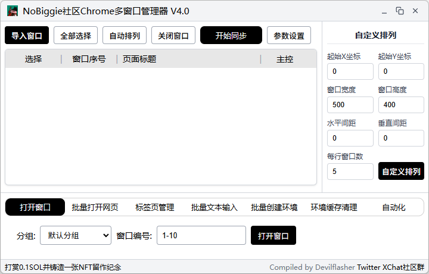

<div align="center">

# ChromeManager V4.0

<strong>Windows / macOS 双平台支持</strong>

[](https://go.dev/)
[](https://wails.io/)
[](https://vitejs.dev/)
[](https://www.microsoft.com/windows)
[](https://www.apple.com/macos/)
[](LICENSE)

<strong>作者：Devilflasher</strong>
[](https://x.com/DevilflasherX)
[](https://x.com/DevilflasherX/status/1781563666485448736 "Devilflasherx")
[](https://x.com/i/chat/group_join/g2043878131141095639/HSWv2DsC7g)

</div>

> ## 免责声明
>
> 1. **本软件为开源项目，仅供学习交流使用，不得用于任何闭源商业用途**
> 2. **使用者应遵守当地法律法规，禁止用于任何非法用途**
> 3. **开发者不对因使用本软件导致的直接/间接损失承担任何责任**
> 4. **使用本软件即表示您已阅读并同意本免责声明**

## 工具介绍

ChromeManager 是一款面向多浏览器环境批量管理与同步操作的桌面工具，最初服务于 `NoBiggie 社区` 的多窗口工作流需求。  
从 2.0 到 4.0，项目已经从 Python 单文件工具，升级为 `Go + Wails 3 + Vite` 的桌面应用架构，界面、同步引擎、环境管理、维护能力与自动化集成都做了系统性重构。

ChromeManager V4.0 在多窗口批量管理的基础上，进一步强化了多浏览器环境、同步操作、维护恢复与自动化接入能力，主要包括：

- 支持 Chrome、Edge、Opera、Brave 环境与分组管理
- 基于 Go 重构同步核心，发挥并发处理优势，提升多窗口鼠标、键盘、网页操作及扩展弹窗同步的响应速度、执行效率与稳定性
- 安全清理环境缓存，减少长期使用产生的存储占用
- 修复受损的扩展安装文件，尽可能保留原有插件数据
- 通过本地 API 接入 OpenClaw、Hermes 等自动化工作流

## 软件界面

<div align="center">
  
</div>

## 从 V2.0 到 V4.0 的主要升级

### 1. 架构层升级

- **从 Python 单体脚本升级为 Go 桌面应用**
  - V2.0 以 Python + Tkinter + PyInstaller 为主
  - V4.0 重构为 `Go 后端 + Wails 3 宿主 + Vite 前端`
- **前后端彻底分层**
  - 后端负责窗口管理、同步、输入、环境、文件与系统交互
  - 前端负责主界面、设置页、功能标签页、模态框与状态提示
- **项目结构模块化**
  - `platform/`：平台能力抽象
  - `syncmanager/`：同步状态与窗口信息管理
  - `utils/`：窗口排列、输入管理、图标、弹窗方向控制、标签页管理等
  - `api/`：本地自动化 API 服务
  - `frontend/`：Vite 前端与模块化 UI
- **构建链路升级**
  - 从 `build.py + PyInstaller` 升级为 `Task + Wails 3 + Vite + Go build + NSIS`
  - 构建流程更规范，便于继续扩展 Windows/macOS/Linux 版本

### 2. UI 与交互升级

- **整体界面从脚本工具风格升级为桌面应用风格**
  - 采用自定义标题栏、主工具栏、窗口列表、右侧控制区和底部功能标签页的布局
- **设置页与功能入口统一整合**
  - 浏览器类型、路径、分组、快捷键、图标、API 与维护工具集中到同一套设置与弹窗体系中
- **交互反馈更完整**
  - 同步状态、操作结果、维护流程与错误提示都有更明确的界面反馈

### 3. 浏览器与环境管理升级

- **从单一 Chrome 逐步扩展到多浏览器类型**
  - Google Chrome
  - Microsoft Edge
  - Opera
  - Brave
- **分组系统**
  - 每个分组可独立维护快捷方式路径和缓存目录
  - 方便分账户、分业务、分项目使用
- **批量环境创建能力增强**
  - 支持直接按编号范围创建环境
  - 自动生成快捷方式与环境缓存目录
  - 支持保存最近一次创建参数
- **环境识别与图标区分增强**
  - 导入窗口后可结合环境编号对快捷方式/任务栏图标进行差异化处理
  - 更方便在大量窗口并行工作时快速识别不同环境
- **更灵活的路径与配置管理**
  - 独立维护浏览器可执行文件路径
  - 支持导入/导出配置
  - 支持清空配置与重启应用

### 4. 同步引擎与稳定性升级

- **同步系统整体重构**
  - 同步链路由更清晰的主控窗口/从窗口模型驱动，状态管理与窗口状态管理解耦
  - 引入更明确的同步生命周期控制，降低切换主控、关闭窗口、批量操作时的状态混乱风险
- **事件链路与弹窗同步增强**
  - 强化基于 Hook 的事件分发链路，优化键盘、鼠标、滚轮等高频输入事件的转发稳定性
  - 针对 Chromium 弹出窗口关系增加缓存识别与关联处理，改善插件弹窗、扩展菜单、浮层的同步表现
- **稳定性与资源控制优化**
  - 在同步链路中进一步引入节流、限频、状态校验与更温和的失败处理策略，减少高负载下的抖动和误触发
  - 主控窗口关闭时可自动执行同步收敛与状态回收，降低残留状态和焦点竞争问题
- **同步快捷键与输入链路升级**
  - 支持设置同步开关键
  - 支持批量随机数字输入、指定文本输入、文件预览与输入参数校验

### 5. 批量操作能力升级

- **批量打开网页**
  - 支持对选定窗口批量导航
  - 支持网址预设保存与删除
- **标签页批量管理**
  - 仅保留当前标签页
  - 仅保留新标签页
- **窗口排列能力增强**
  - 自动排列
  - 自定义排列
  - 多屏幕信息识别
  - 自定义排列参数持久化
- **图标维护**
  - 自动修改快捷方式图标
  - 还原默认图标
  - 清理图标缓存

### 6. 维护与恢复能力升级

- **安全批量关闭链路**
  - 关闭窗口前会考虑同步状态、主控状态与环境释放时序
  - 提供可调节的批量关闭间隔
- **环境缓存清理**
  - 扫描指定分组、指定窗口编号对应环境的安全缓存目录
  - 跳过运行中的环境
  - 不碰插件、书签、Cookie、登录数据、Secure Preferences 等关键数据
- **扩展修复**
  - 当扩展安装文件损坏或丢失、但数据仍可能存在时
  - 可从一个正常环境复制扩展安装文件到受损环境
  - 用于减少“修复按钮重置插件”的损失

### 7. 自动化接入与本地 API

- **本地自动化 API**
  - 支持 127.0.0.1 本地接口
  - 支持 Token 与端口配置
  - 可供 OpenClaw、Hermes 等外部 Agent 安全调用
- **自动化面板**
  - 提供 OpenClaw / Hermes 接入入口
  - 提供 Skills 仓库地址与安装说明
  - 提供示例指令与基础使用提示
- **任务协同能力**
  - 外部 Agent 负责任务理解与流程编排
  - ChromeManager 负责窗口准备、批量导航与执行接口

## 功能特性

- `批量窗口管理`：打开、导入、全选、关闭已导入环境
- `多浏览器支持`：Chrome / Edge / Opera / Brave
- `分组管理`：不同分组使用独立快捷方式目录与缓存目录
- `批量环境创建`：一键生成编号化多开环境与快捷方式
- `图标区分`：导入窗口后可按环境编号区分快捷方式/任务栏图标
- `自动/自定义排列`：支持多屏和参数化排列
- `批量打开网页`：支持网址预设
- `标签页管理`：仅保留当前标签页 / 仅保留新标签页
- `批量输入`：随机数字输入、指定文本输入、文件文本输入
- `同步控制`：主控窗口、从窗口、同步快捷键、弹窗联动
- `图标维护`：自动改图标、还原默认、清缓存
- `环境缓存清理`：安全扫描 + 清理可释放缓存
- `扩展修复`：复制扩展安装文件，尽量保留原始插件数据
- `本地自动化 API`：供 OpenClaw / Hermes 等外部 Agent 调用
- `系统托盘`：最小化到托盘、托盘恢复

## 目录结构

```text
ChromeManager V4.0/
├─ ChromeManager V4.0_win/   # Windows 版本
├─ ChromeManager V4.0_mac/   # macOS 版本
├─ README.md                 # 统一说明
├─ LICENSE                   # GPL-3.0
└─ .gitignore                # 统一忽略规则
```

## 环境要求

### 运行成品程序

- Windows：Windows 10 / 11（64-bit）、Chromium 内核浏览器；全新系统还需要 `Microsoft Edge WebView2 Runtime`
- macOS：已安装对应 Chromium 内核浏览器
- 同步功能建议使用管理员权限运行

### 从源码构建

- Go 1.24.3+
- Node.js LTS 与 npm
- Task
- Wails 3 CLI
- Windows 安装包额外需要 NSIS
- macOS 需要 Xcode Command Line Tools

## 从源码构建

### 视频版教程请移步本人推特这篇推文观看

<!-- 在此处添加 ChromeManager V4.0 视频教程的推文链接。 -->

### Windows

进入 Windows 子目录后运行构建工具：

```bat
cd "ChromeManager V4.0_win"
build.bat
```

`build.bat` 会检查构建环境并生成无终端窗口的正式版程序。输出位于：

- 可执行文件：`bin/ChromeManager.exe`

也可以手动执行：

```bat
cd "ChromeManager V4.0_win"
task build
task package
```

`task build` 默认生成正式 GUI 程序；开发调试请使用：

```bat
task dev
```

### macOS

进入 macOS 子目录后运行构建工具：

```bash
cd "ChromeManager V4.0_mac"
bash ./build.command
```

构建工具会检查 macOS 所需环境并提供构建选项。

## 使用说明

### 前期准备：配置浏览器与分组

1. **打开设置**
   - 点击右上角 `参数设置`

2. **选择浏览器类型**
   - 可切换 Chrome / Edge / Opera / Brave

3. **设置基础路径**
   - 快捷方式路径
   - 缓存目录
   - 浏览器可执行文件路径

4. **按需启用分组**
   - 可为不同业务/项目创建独立分组
   - 每个分组维护独立快捷方式目录与缓存目录

### 批量创建环境

1. 打开底部 `批量创建环境`
2. 选择分组
3. 输入编号范围，例如：
   - `1-10`
   - `1,3,5`
   - `1-10,15,18`
4. 点击 `开始创建`

程序会自动生成：

- 对应编号的快捷方式
- 对应编号的浏览器环境目录

### 打开与导入窗口

1. 在 `打开窗口` 页输入窗口编号范围
2. 点击 `打开窗口`
3. 点击顶部 `导入窗口`
4. 在列表中勾选需要参与同步或批量操作的窗口

### 窗口排列

- 使用顶部 `自动排列`
- 或使用右侧 `自定义排列`
- 支持保存排列参数并重复使用

### 开启同步

1. 在窗口列表中设置一个主控窗口
2. 选择其余从窗口
3. 点击 `开始同步`
4. 也可以使用设置中配置的同步快捷键

### 批量网页与输入操作

- `批量打开网页`
  - 输入网址后批量导航
  - 支持网址预设
- `标签页管理`
  - 仅保留当前标签页
  - 仅保留新标签页
- `批量文本输入`
  - 随机数字输入
  - 指定文本输入

### 环境维护

#### 1. 环境缓存清理

1. 打开底部 `环境缓存清理`
2. 选择分组与窗口编号
3. 点击 `扫描并清理`
4. 在弹窗中先 `开始扫描`
5. 确认可清理项后执行 `执行清理`

该功能只处理安全缓存目录，不会主动删除：

- 插件
- 书签
- Cookie
- Login Data
- Local Storage
- IndexedDB
- Secure Preferences

#### 2. 扩展修复

适合以下场景：

- 扩展管理页提示扩展损坏
- 扩展图标整体消失
- 不希望直接点击浏览器的“修复”按钮导致插件重置

使用方式：

1. 打开 `设置`
2. 找到 `扩展修复`
3. 输入受损窗口编号
4. 输入一个正常环境编号作为克隆环境
5. 点击 `修复`

修复完成后，再去浏览器官方商店重新安装官方扩展，原始数据有机会继续沿用。

### 自动化

打开底部 `自动化` 页后，可查看：

- OpenClaw 接入说明
- Hermes 接入说明
- Skills 仓库地址
- 示例指令

用于把 ChromeManager 的本地 API 接入外部 Agent，协助完成窗口准备、批量导航和网页任务执行。

## 注意事项

- 同步功能建议使用管理员权限运行
- 请尽量通过软件创建或打开的 `user-data-dir` 环境进行导入和同步
- 不建议多个实例共用同一个环境目录
- 批量关闭窗口后，不建议立刻马上重新打开同一批环境
- 当系统资源占用过高时，插件菜单、扩展弹窗和 UI 同步成功率会下降
- 环境缓存清理只清理安全目录，不是“重置环境”
- 扩展修复恢复的是扩展安装文件，不是万能修复；如果底层浏览器已判定扩展完整性异常，仍需重新安装官方扩展

## 常见问题

1. **4.0 版本为什么打包方式和 2.0 不一样？**
   - 2.0 使用 Python + PyInstaller
   - 4.0 已重构为 Go + Wails 3 + Vite
   - 因此打包方式改为 Windows 的 `build.bat / task build / task package` 与 macOS 的 `build.command`
   - 这也是 4.0 能继续扩展 Windows、macOS 前端统一界面的基础

2. **构建失败怎么办？**
   - Windows：进入 `ChromeManager V4.0_win` 后运行 `build.bat`
   - macOS：进入 `ChromeManager V4.0_mac` 后运行 `bash ./build.command`
   - 如果前端依赖损坏，可在对应子目录删除 `frontend/node_modules` 后重新 `npm install`

3. **打包后程序打不开，提示 WebView2 问题怎么办？**
   - 4.0 基于 Wails WebView 运行
   - 纯净 Windows 环境下请先安装 `Microsoft Edge WebView2 Runtime`
   - 生成安装包时会包含 WebView2 bootstrapper 支持

4. **为什么无法导入窗口？**
   - 大多数情况是窗口不是通过独立 `user-data-dir` 启动的
   - 请优先使用软件创建的环境快捷方式来打开窗口
   - 混入系统主浏览器或普通登录态窗口时，导入结果可能不稳定

5. **为什么开启同步后，部分窗口没跟上？**
   - 请确认程序以管理员权限运行
   - 请确认主控窗口已正确设置
   - 当系统 CPU / 内存占用很高时，同步流畅度会明显下降
   - 插件菜单、扩展按钮这类 UI 元素本身对系统时序比较敏感

6. **为什么插件会损坏或突然不显示？**
   - 常见诱因包括：
     - 环境关闭过快，浏览器来不及完整写入
     - 高资源占用下环境保存链路被打断
     - 浏览器检测到 `Preferences / Secure Preferences` 或扩展安装文件不一致
   - 建议：
     - 不要暴力结束浏览器进程
     - 关闭环境后稍等一会再重新打开
     - 必要时先使用 `扩展修复` 恢复扩展安装文件

7. **环境越来越大，如何安全清理？**
   - 使用底部 `环境缓存清理`
   - 该功能只清理安全缓存目录
   - 不会主动清除插件、书签、Cookie 与登录数据

8. **扩展修复后为什么还要去商店重新安装官方插件？**
   - 这个功能恢复的是扩展安装文件和显示链路
   - 如果浏览器已经把扩展状态标记为异常，仍可能需要官方重装来重新建立完整性
   - 好处是原始数据目录通常还在，重装后更容易直接恢复登录状态

9. **自动化接入怎么用？**
   - 在 `设置 -> OpenClaw API 集成` 中启用本地 API
   - 复制 Token
   - 按 `自动化` 面板中的说明导入 `chromemanager-skill`
   - 再通过 OpenClaw / Hermes 使用 `/cm`、`/chromemanager` 或等价自然语言下发任务

10. **关闭主窗口后程序为什么没有完全退出？**
   - 4.0 支持最小化到托盘
   - 可以在设置中调整关闭行为
   - 也可以从托盘菜单中重新打开主界面或退出程序

## 支持项目

ChromeManager 始终保持开源与免费。如果它确实帮到了你，欢迎以 `0.1 SOL` 铸造 NFT，支持后续的功能打磨、测试与跨平台维护。是否支持完全自愿，感谢每一位愿意同行的朋友。

<div align="center">
  <a href="https://tip-receipt.vercel.app/">
    
  </a>
</div>

<p align="center">
  <a href="https://tip-receipt.vercel.app/">
    
  </a>
</p>

## 更新日志

### v4.0

- **架构重构**
  - 从 Python 单体脚本升级为 Go + Wails 3 + Vite 的桌面应用架构
  - 前后端分层，项目模块化重组，便于继续维护与跨平台扩展
  - 引入 Task/Wails 构建链路，替代原来的 PyInstaller 打包方式

- **界面重构**
  - 主界面改为桌面应用风格布局：标题栏、工具栏、窗口列表、右侧排列面板、底部功能标签页
  - 设置界面重构为统一模态框，整合浏览器、路径、分组、热键、图标、API 与维护功能
  - 新增更完整的状态提示、通知与模态交互

- **浏览器与分组能力**
  - 支持 Chrome / Edge / Opera / Brave 多浏览器类型
  - 新增分组管理，每个分组可独立维护快捷方式目录和缓存目录
  - 环境创建逻辑改造，支持记忆最近参数与更清晰的创建流程

- **同步与窗口管理**
  - 同步链路重构，主控窗口、从窗口和同步生命周期管理更清晰
  - 优化主控切换、主控关闭后的自动停同步逻辑
  - 弹窗与插件窗口同步逻辑继续增强
  - 支持同步快捷键设置
  - 保留并优化自动排列、自定义排列、多屏支持等能力

- **批量操作能力增强**
  - 批量打开网页支持预设网址管理
  - 标签页批量管理继续保留并整合进新界面
  - 批量输入升级为随机数字输入与指定文本输入两套流程

- **维护工具新增**
  - 新增环境缓存清理：可按分组与窗口编号扫描并清理安全缓存目录
  - 新增扩展修复：用于在扩展安装文件损坏时，尽量保留原始插件数据地恢复显示
  - 新增配置导入/导出、图标恢复、图标缓存清理、全部数据重置

- **自动化能力新增**
  - 新增本地自动化 API
  - 支持 OpenClaw / Hermes 接入
  - 新增自动化面板、Skills 仓库入口与示例指令

- **关闭与稳定性优化**
  - 批量关闭链路更安全，支持关闭间隔配置
  - 更注重环境释放状态，减少关闭后立即重开带来的时序问题
  - 增强托盘、关闭行为与主窗口显示逻辑

### v2.0

- 同步引擎重构
- 批量环境创建
- 多屏支持
- 批量标签管理
- 同步状态通知
- 批量文本输入
- 插件弹窗同步增强

### v1.0

- 首次发布
- 实现基础窗口管理与同步功能

## 许可说明

本项目采用 `GPL-3.0 License`。  
允许学习、使用、修改与再分发，但分发本项目或其修改版本时，需继续遵守 GPL-3.0，并保留原始版权与许可证声明。  
不允许将本项目及其修改版本以闭源方式重新发布或用于闭源分发。

持续更新中。
